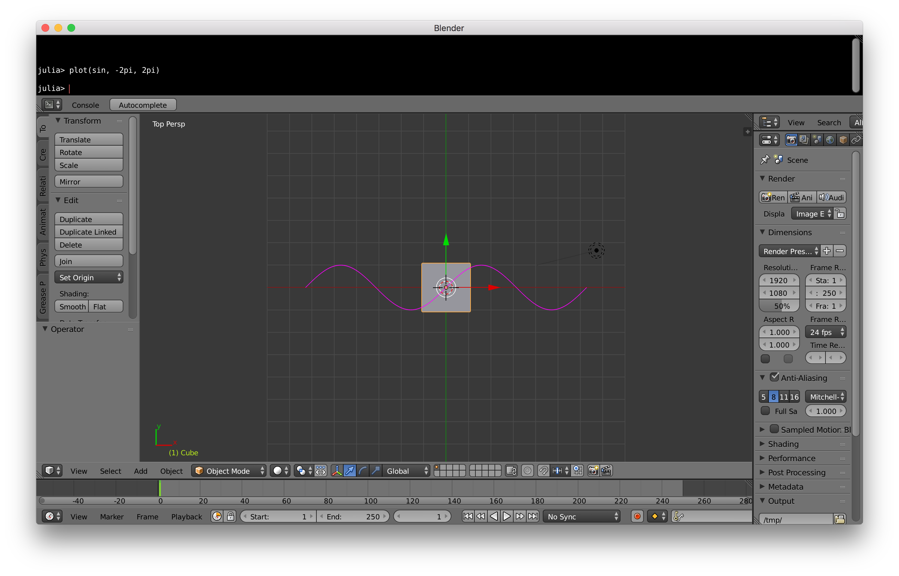

# BlenderPlot

a prototype version of the 📊  plot on [Blender](https://www.blender.org/) using PyCall


# Build Blender

- checkout from <https://github.com/wookay/blender>
- edit for your environment ([see the commit](https://github.com/wookay/blender/commit/d8e919936ec189be1a0b13ff83215538516a78e9))
- Building Blender for macOS <https://wiki.blender.org/index.php/Dev:Doc/Building_Blender/Mac>


# Install Julia, pyjulia

- get Julia 0.6 <https://julialang.org/downloads/>
- install pyjuila <https://github.com/JuliaPy/pyjulia>

# PyCall.jl, BlenderPlot.jl
- add PyCall.jl

```julia
julia> Pkg.add("PyCall")
```

- clone BlenderPlot.jl

```julia
julia> Pkg.clone("https://github.com/wookay/BlenderPlot.jl")
```


### Examples

- run Blender
- run this under the Blender Python Console

```julia
julia> plot(sin, -2pi, 2pi)
```

- press `7` for top orthographic view
 
