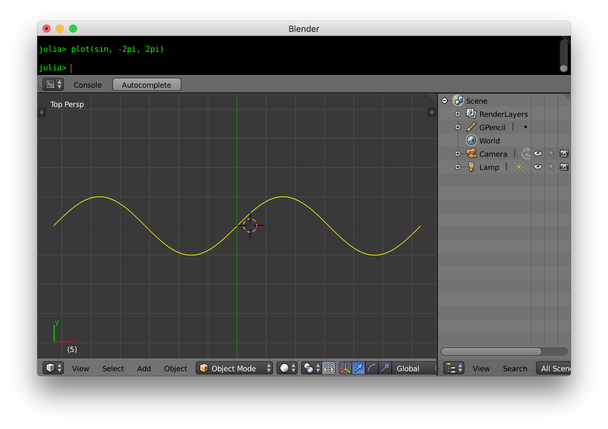
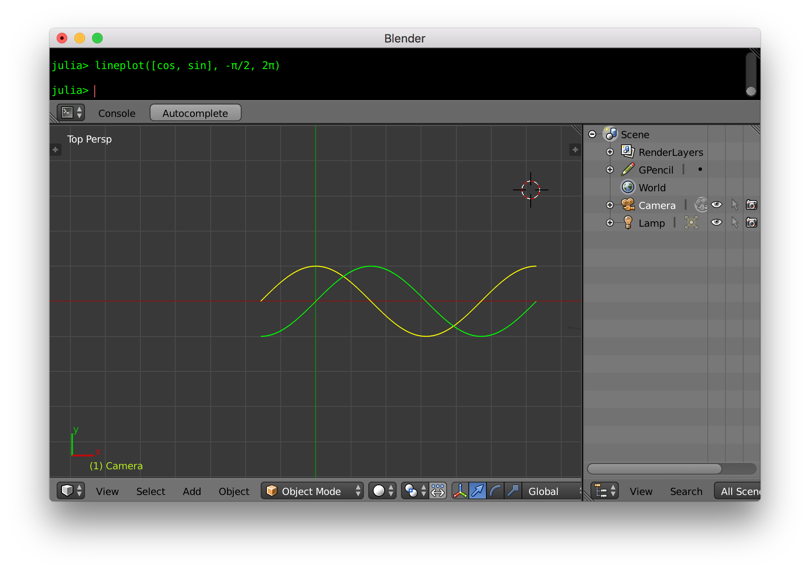
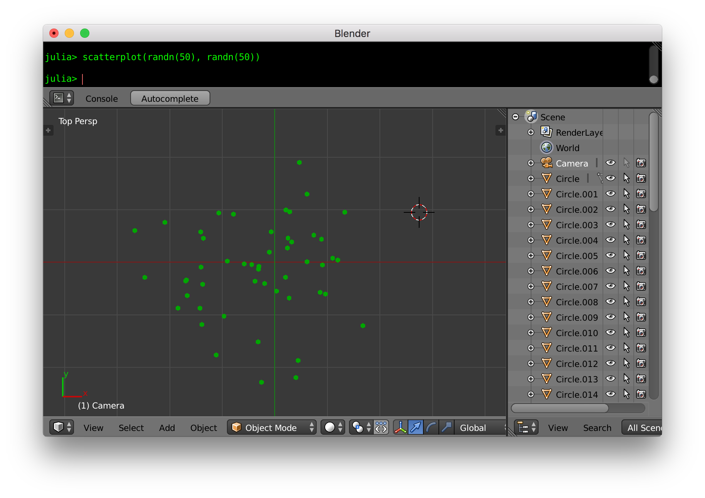
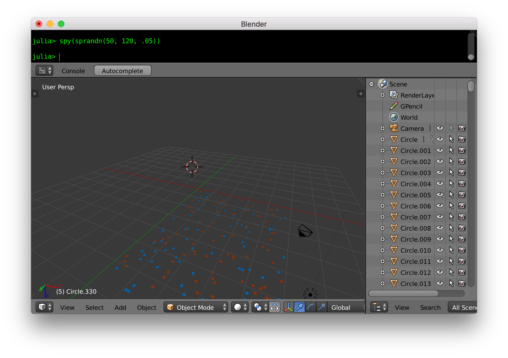
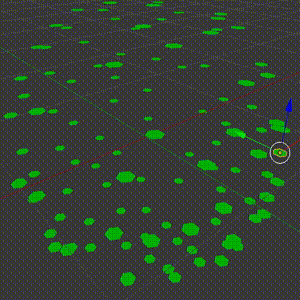

# BlenderPlot

a prototype version of the 📊  plot on [Blender](https://www.blender.org/) using PyCall


# Build Blender

- Clone from <https://github.com/wookay/blender>
```sh
cd ~/blender-build
git clone https://github.com/wookay/blender
```
- Edit for your environment ([ref the commit](https://github.com/wookay/blender/commit/556f6878ea8b2c681918fa494225a0c189636121))
- Building Blender for macOS <https://wiki.blender.org/wiki/Building_Blender/Mac>

- Custom linking
```sh
cd ~/blender-build/build_darwin/bin/blender.app/Contents/Resources/2.79
rm -rf python
ln -s /usr/local/Frameworks/Python.framework/Versions/3.6 python
cd ~/blender-build/build_darwin/bin/blender.app/Contents/Resources/2.79/scripts
rm -rf modules
ln -s ~/blender-build/blender/release/scripts/modules
```


# Install Julia, pyjulia

- Get Julia 0.7-alpha <https://julialang.org/downloads/>
- Install pyjuila <https://github.com/wookay/pyjulia>


# Install PyCall.jl, BlenderPlot.jl

`julia>` type `]` key

```julia
(v0.7) pkg> add PyCall#master
(v0.7) pkg> add ColorTypes#master
(v0.7) pkg> add Colors#master
(v0.7) pkg> add https://github.com/wookay/BlenderPlot.jl#master
```

* Precompiling packages
```
julia> using PyCall, ColorTypes, Colors
```


# Blender, Julia Console

- Run Blender
```sh
~/blender-build/build_darwin/bin/blender.app/Contents/MacOS/blender
```

- Julia Console


### Examples

```julia
julia> plot(sin, -2pi, 2pi)
```

- press `7` for top orthographic view
 

```julia
julia> lineplot([cos, sin], -π/2, 2π)
```
 

```julia
julia> scatterplot(randn(50), randn(50))
```
 

```julia
julia> spy(sprandn(50, 120, .05))
```
 

- https://github.com/wookay/BlenderPlot.jl/blob/master/examples/sphere.jl
 
